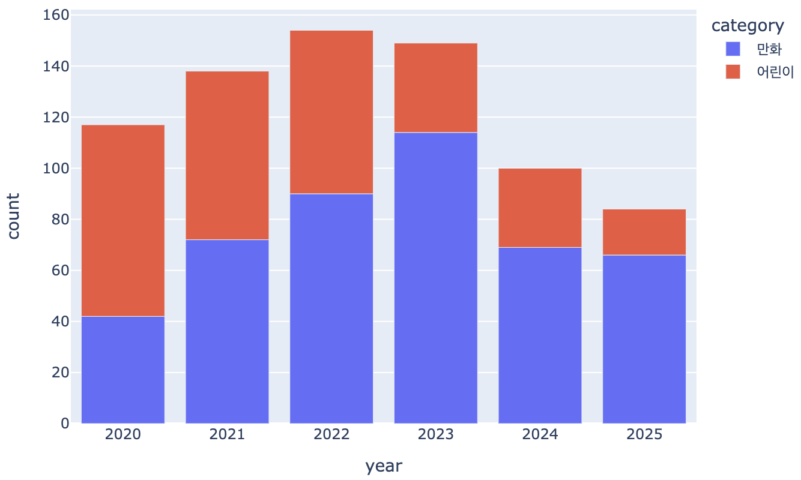
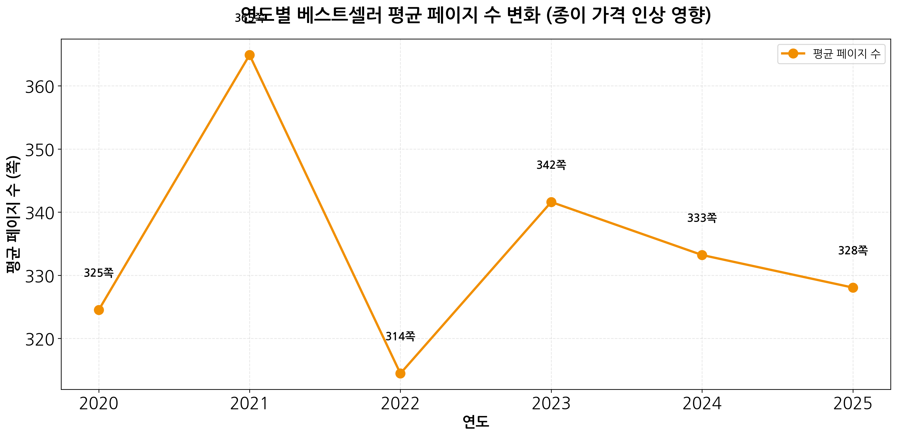

# 알라딘 월간 베스트셀러 독서 트렌드 분석 보고서  
**기간: 2020년 1월 ~ 2025년 11월**

알라딘 월간 베스트셀러 데이터를 기반으로 독서 트렌드 변화를 분석하고, 한강 작가의 노벨문학상 수상이 출판 시장에 미친 영향을 심층 분석한 프로젝트의 최종 보고서입니다.

---

# 1. 프로젝트 목적

본 프로젝트는 2020~2025년 알라딘 월간 베스트셀러 데이터를 크롤링 및 분석하여 다음을 파악하는 것을 목표로 합니다.

- 연도별 독서 트렌드 변화 분석
- 카테고리별 인기 장르 변화
- 한강 노벨문학상 효과 심층 분석 (핵심)
- GPT 예측 결과와 실제 데이터 비교
- 사회적 사건과 독서 트렌드의 상관성 분석

---

# 2. 데이터 수집

## 1단계 크롤링 (월간 베스트셀러 리스트)
- 수집 대상: 알라딘 월간 베스트셀러 TOP 50 (2020.01~2025.11, 71개월)
- 도구: BeautifulSoup4, urllib
- 수집 항목:
  - year / month / rank  
  - category (상위 카테고리)
  - title, author  
  - price, star_score  
  - item_id (도서 고유 ID)
- 수집량: 71개월 × 50개 = 3,550개

## 2단계 크롤링 (도서 상세 페이지)
- 수집 대상: 고유 도서 1,960개
- 도구: BeautifulSoup4 + 병렬 처리
- 수집 항목:
  - real_category (상세 카테고리)
  - page_count (페이지 수)

## 크롤링 이슈 및 해결

### 문제 1: HTML 선택자 오타
```
초기 코드: category_tag = item.select_one("span.tit_catrgory")  # 오타
수정 코드: category_tag = item.select_one("span.tit_category")  # 정상

결과:
- 오타로 인해 모든 도서 카테고리 "N/A" 발생
- 수정 후 "국내도서" 포괄 카테고리 정상 수집
- 데이터 완성도 향상
```

### 문제 2: 성인 도서 크롤링 제한
```
성인 인증이 필요한 도서:
- 상세 페이지 접근 불가
- page_count = 0으로 수집됨
- 전처리 단계에서 제거 (23개)
```

---

# 3. 데이터 저장 및 구조화

## 파일 구조
```
data/
├── raw/
│   ├── aladin.csv              (1차 크롤링, 3,540개)
│   └── detail_mapping.csv      (2차 크롤링, 1,960개)
└── processed/
    └── aladin_final_cleaned.csv (최종 데이터, 3,517개)
```

## 데이터 정제 과정
```
원본 데이터:           3,540개
↓
item_id 기준 병합
↓
상세 카테고리 업데이트
↓
페이지 수 0 제거:      -23개
↓
최종 데이터:           3,517개
```

---

# 4. 데이터 전처리

## 주요 작업
1. 데이터 병합: item_id 기준으로 1차·2차 크롤링 데이터 병합
2. 카테고리 업데이트: real_category가 존재하면 category 교체
3. 성인 도서 제거: page_count = 0인 도서 삭제 (23개)
4. 데이터 검증: 결측치 확인 및 데이터 형식 통일

## 최종 데이터 통계
```
기간: 2020.01 ~ 2025.11 (71개월)
총 행 수: 3,517개
고유 도서: 1,960개
카테고리: 21개
페이지 수 정보: 99.1%
```

---

# 5. 시각화 및 인사이트 분석

본 프로젝트에서는 총 15개의 시각화를 생성하여 독서 트렌드를 다각도로 분석했습니다.

---

## Part 1: 독서 트렌드 분석

### 시각화 1: 연도별 베스트셀러 평균 가격 추이  


#### 주요 데이터
```
2020년: 14,481원
2021년: 15,386원 (+6.2%)
2022년: 14,481원 (-5.9%)
2023년: 15,348원 (+6.0%)
2024년: 16,010원 (+4.3%)
2025년: 16,155원 (+0.9%)

2020년 대비 2025년: +11.6% 상승
```

#### 인사이트
- 5년간 약 11.6% 가격 상승
- **2022년 하락의 의미:**
  - 베스트셀러 기준으로는 -5.9% 하락
  - 그러나 출판 시장 전체 신간 평균 가격은 상승 추세 유지


*출처: 대한출판문화협회(2023.07.17)*

  - **베스트셀러 vs 전체 신간 비교 (2022년):**
    - 베스트셀러: 2021년 15,386원 → 2022년 14,481원 (-5.9%)
    - 전체 신간: 2021년 17,116원 → 2022년 17,869원 (+4.4%)
  - **원인 분석:** 2022년 베스트셀러는 만화·어린이 등 저가·저페이지 장르 비중이 크게 증가해 평균 가격이 낮아진 것으로 확인됨
  - **시사점:** 베스트셀러 평균 가격은 전체 출판 시장 가격 흐름과 다르게 움직일 수 있으며, 해당 해의 장르 구성에 크게 좌우됨

**참고:** 본 데이터는 베스트셀러 기준이며, 전체 출판 시장 평균과는 차이가 있음

---



### 연도별 만화·어린이 베스트셀러 진입 횟수 (검증용)



#### 주요 데이터
```
2020년: 325쪽
2021년: 365쪽 (+12.3%) ← 급등
2022년: 314쪽 (-14.0%) ← 급락
2023년: 342쪽 (+8.9%)
2024년: 333쪽 (-2.6%)
2025년: 328쪽 (-1.5%)

2020년 대비 2025년: +0.9% (거의 동일)
```

#### 인사이트
- 2022년 평균 페이지 수 하락은 만화·어린이 등 비교적 페이지 수가 짧은 장르 비중이 증가한 영향이 큼
- 최종 수렴: 2025년 328쪽으로 2020년(325쪽)과 거의 동일

---

### 시각화 3: 카테고리별 도서 수 TOP 20  


#### 주요 데이터
```
TOP 5 카테고리:
1. 소설/시/희곡: 742개 (21.1%)
2. 만화: 453개 (12.9%)
3. 인문학: 335개 (9.5%)
4. 경제경영: 314개 (8.9%)
5. 어린이: 289개 (8.2%)

상위 5개 카테고리 합계: 2,133개 (전체의 60.6%)
```

#### 인사이트
- 소설 압도적 1위: 전체의 21.1% 차지
- 만화 2위: 웹툰·라이트노벨 기반 도서 포함
- 인문학 3위: 가치 지향적 독서 트렌드 반영
- 시장 집중도: 상위 5개 카테고리가 전체의 60.6% 차지, 베스트셀러 시장은 소수 카테고리에 집중된 구조

---

### 시각화 4: 연도별 카테고리 비중 변화  


#### 주요 데이터
```
TOP 5 카테고리 비중 변화:

만화:
- 2020년: 17% → 2023년: 32% (정점)
- 2023년: 32% → 2025년: 15% (-17%p 급락)

인문학:
- 2020년: 8% → 2025년: 23% (+15%p, 약 3배 증가)

경제경영:
- 2020년: 18% → 2021년: 20% (정점)
- 2021년: 20% → 2025년: 8% (-12%p)
```
#### 인사이트

**1. 2023년 만화 급상승: 더 퍼스트 슬램덩크 효과**
- 2023년 1월 4일 개봉한 영화 "더 퍼스트 슬램덩크"의 흥행 영향
- **박스오피스 성적 (2023년 4~6주차):**
  - 3주 연속 박스오피스 1위
  - 누적 관객수: 4,903,577명
  - 누적 매출액: 513억 원
- **수상 실적:**
  - 2023년 제46회 일본 아카데미상 수상
- **출판 시장 영향:**
  - 영화 흥행으로 원작 만화에 대한 관심 급증
  - 베스트셀러 만화 비중: 2022년 → 2023년 32% (정점 달성)
  - 영화의 성공이 종이책 만화 시장에 직접적 영향

**2. 만화의 급락 (2023년 이후)**
- 베스트셀러 만화 비중: 2023년 32% → 2025년 15% (-17%p)
- 슬램덩크 효과 종료 후 급격한 하락세

**3. 인문학의 급증**
- 2020년 8% → 2025년 23% (약 3배 증가)

**4. 경제경영의 쇠퇴**
- 2021년 재테크 붐 이후 지속 하락
- 2021년 20% → 2025년 8%

**5. 독서 트렌드의 분기점**
- 만화 정점과 인문학 본격 부상이 교차
- 2023년이 독서 트렌드 변화의 중요한 분기점으로 작용
- 슬램덩크 흥행은 일시적 현상

---

### 시각화 5: 월별 카테고리 트렌드 (계절성)


#### 주요 데이터
```
소설/시/희곡:
- 여름(6-8월): 60-72회 (최고)
- 가을(9-11월): 59-70회
- 겨울-봄(1-3월): 33-50회
- 10월: 72회 (연중 최고, 독서의 달 효과)

만화:
- 겨울-봄(1-2월): 42-51회 (최고)
- 가을(9-12월): 21-25회 (최저)

인문학:
- 연중 안정적 (40-47회)
- 뚜렷한 계절성 없음
```

#### 인사이트
- "가을은 독서의 계절" 확인: 10월 소설 진입 최고치
- 만화의 계절성: 1-2월에 상승하는 패턴, 방학·명절 기간의 독서 수요 증가와 관련되었을 가능성
- 소설 vs 만화 반대: 여름은 소설, 겨울은 만화
- 인문학의 안정성: 계절 변동 없는 꾸준한 수요

---

## Part 2: 한강 노벨문학상 효과 분석

### 시각화 11: 한강 작가 vs 소설 시장 전체


#### 주요 데이터
```
수상 전 평균 점유율: 0.5% (2020.1~2024.9, 57개월 평균)
수상 후 평균 점유율: 7.2% (2024.10~2025.11, 14개월 평균)
점유율 증가: +6.7%p (14.4배, 1,340% 증가)

월별 최고점: 2024년 10월 17.3%
```

#### 인사이트
- 수상 직후 급격한 반응: 점유율 0.5% → 17.3%
- 지속적 영향력: 2025년까지 평균 7.2% 유지
- 소설 시장 활성화: 전체 소설 시장은 안정적, 한강 효과만 급증

---

### 시각화 12: 한강 작가 수상 전후 비교


#### 주요 데이터
```
수상 전 (2020.1~2024.9): 7회
수상 후 (2024.10~2025.11): 60회
증가율: +757% (약 8배)
```

#### 인사이트
- 압도적 증가: 5년간 7회 → 14개월간 60회
- 지속성: 단기 현상이 아닌 장기 트렌드로 정착
- 한국 문학에 대한 관심 증가: 개인 작가를 넘어선 문학 전반의 관심 증가를 시사

---

### 시각화 13: 한강 작품별 진입 횟수 TOP 5


#### 주요 데이터
```
1. 소년이 온다: 13회
2. 작별하지 않는다: 13회
3. 채식주의자 (리마스터판): 8회
4. 흰: 5회
5. 서랍에 저녁을 넣어 두었다: 5회
```

#### 인사이트
- 대표작 집중: 소년이 온다, 작별하지 않는다
- 구작 재조명: 채식주의자 리마스터판 인기
- 신작 효과: 흰, 서랍에 저녁을 넣어 두었다 등 신작도 진입

---

### 시각화 14: 한강 작품 가격 비교


#### 주요 데이터
```
한강 작품: 13,849원
소설 카테고리: 16,410원
전체 베스트셀러: 15,297원

한강 작품이 15.5% 저렴
```

#### 인사이트
- 합리적 가격: 전체 평균보다 저렴
- 접근성 높음: 소설 평균 대비 2,561원 저렴
- 가격 경쟁력: 저렴한 가격이 진입 장벽 낮춤

---

### 시각화 15: 한강 작품 평점 비교


#### 주요 데이터
```
한강 작품: 8.99점
소설 카테고리: 8.86점
전체 베스트셀러: 9.05점
```

#### 인사이트
- 우수한 평가: 소설 평균보다 높은 평점
- 품질 보증: 노벨상 수상 작가의 신뢰도
- 전체 평균과 근접: 베스트셀러 수준의 품질 유지

---

# 6. GPT 예측 vs 실제 비교

## GPT 예측 내용

### 2020~2021년 (코로나 초기)
- 예측: 아동·웹툰·에세이 강세, 힐링 도서 증가
- 실제: 부분 적중 - 만화 453개(2위), 어린이 289개(5위)

### 2022~2023년 (포스트 코로나)
- 예측: 경제·자기계발 증가, 재테크 붐
- 실제: 적중 - 경제경영 2021년 20% 정점

### 2024~2025년 (AI 시대)
- 예측: AI·IT 서적 강세, 실무 실용서 증가
- 실제: 미적중 - 인문학 급증(3배), AI/IT 서적 TOP 20에 없음

## GPT 예측 평가

### 맞춘 트렌드
```
1. 코로나 시기 만화·아동 강세
2. 경제경영 증가 (2021-2023)
3. 재테크 관련 도서 붐
4. 웹툰·아동 꾸준한 인기
```

### 예측하지 못한 트렌드
```
1. 한강 노벨문학상 효과 (2024년 최대 이슈)
   - 전혀 예측하지 못함
   - 757% 증가, 시장 점유율 0.5% → 7.2%

2. 인문학의 폭발적 성장
   - 2020년 8% → 2025년 23% (약 3배)
   - GPT는 "AI 서적"만 예측

3. 만화의 급격한 하락
   - 2023년 32% → 2025년 15%
   - GPT는 "꾸준히 유지"로 예측

4. AI/IT 서적의 부재
   - 예측과 달리 TOP 20에 나타나지 않음
   - 오히려 인문학이 급증
```

## 예측의 한계

### GPT가 놓친 핵심 이유

1. 예측 불가능한 사건
   - 한강 노벨문학상 (2024.10)
   - 사회적 이벤트는 AI 예측 불가

2. 트렌드의 질적 전환 간과
   - "정보 소비 → 성찰" 전환
   - 인문학 급증 예측 실패

3. 플랫폼 이동 미반영
   - 웹툰 플랫폼으로의 이동
   - 만화책 수요 급락

4. 과대 예측
   - AI/IT 서적 진입 예상
   - 실제로는 나타나지 않음

## 시사점

GPT 예측은 과거 패턴 기반 트렌드(코로나 → 경제불안 → 실용서 증가)는 잘 포착했으나, 예상치 못한 외부 요인(노벨상 수상)과 인문학 성장 같은 구조적 변화는 포착하지 못했습니다. 이는 AI 예측의 한계를 보여주며, 실제 데이터 분석과 실시간 모니터링을 병행해야 함을 시사합니다.

---

# 7. 핵심 인사이트

## 1. 독서의 질적 전환
```
2020-2022: "빠른 소비" 시대
- 만화, 경제경영 강세
- 정보 획득 중심

2023-2025: "가치 지향적 독서" 시대
- 인문학 약 3배 증가 (8% → 23%)
- 만화 급락 (32% → 15%)
- 성찰적 독서 선호
```

## 2. 2023년: 독서 트렌드 변화의 분기점
```
- 만화 32% 정점 후 급락
- 인문학 본격 부상
- 만화 정점과 인문학 성장이 교차하며 독서 트렌드 변화의 중요한 분기점으로 작용
```

## 3. 한강 노벨효과: 개인을 넘어선 파급력
```
진입 횟수: 7회 → 60회 (757% 증가)
시장 점유율: 0.5% → 7.2%
월별 1위 6개월 독점 (2024.10-12, 2025.1, 2025.6-8)
한국 문학에 대한 관심 증가
```

## 4. 출판 시장의 균형 전략
```
가격: +11.6% 상승
페이지: +0.9% 유지

→ 출판사의 균형 전략
   (가격은 올리되 페이지는 유지)
```

---

# 8. 기술 스택

- 언어: Python 3.10+
- 크롤링: BeautifulSoup4, urllib
- 데이터 처리: Pandas, NumPy
- 시각화: Matplotlib, Seaborn
- 환경: Google Colab
- 저장/관리: Google Drive

---

# 9. 결론 및 시사점

## 주요 발견

1. 사회적 사건의 즉각적 반영
   - 한강 노벨문학상이 출판 시장에 미친 급격한 영향
   - 14개월간 757% 증가, 시장 점유율 14배 상승

2. 독서 트렌드의 질적 전환
   - 2020-2022: 빠른 소비 (만화, 경제경영)
   - 2023-2025: 가치 지향적 독서 (인문학 약 3배 증가)

3. 출판 시장의 가격 전략
   - 가격 11.6% 상승, 페이지 수 유지
   - 종이값 인상 압박 속 균형 추구

## 활용 가능성

### 1. 출판·도서 기획
- 인문학 트렌드 지속 전망
- 문학 작품의 재조명 가능성
- 노벨상 수상 작가의 구작 발굴

### 2. 서점·온라인 플랫폼
- 문학 작품 추천 시스템 강화
- 계절별 마케팅 전략 (10월 독서의 달)
- 작가별 큐레이션 서비스

### 3. 교육·연구
- 사회문화 변화와 독서 트렌드 분석
- 문학 교육 자료 활용
- 출판 시장 구조 연구

### 4. AI 및 데이터 분석
- 예측 모델의 한계 확인
- 실시간 데이터 분석의 중요성
- 돌발 변수 대응 전략 필요

---

## 연구의 한계

### 1. 베스트셀러 중심 분석의 한계
본 연구는 알라딘 월간 베스트셀러 TOP 50만을 대상으로 하므로, 전체 출판 시장과는 다른 특성을 보일 수 있습니다.

**예시: 2022년 가격 변화의 차이**


*출처: 대한출판문화협회(2023.07.17)*

| 구분 | 2021년 | 2022년 | 증감 |
|------|--------|--------|------|
| 베스트셀러 평균 (본 연구) | 15,386원 | 14,481원 | -5.9% ↓ |
| 전체 신간 평균 (대한출판문화협회) | 17,116원 | 17,869원 | +4.4% ↑ |

**차이 발생 원인:**
- **경제 불황 시 소비 패턴 변화:** 2022년 경제 불황으로 독자들이 가성비 높은 저가 도서를 선호
- **베스트셀러 특성:** 저가 도서가 베스트셀러에 진입하기 쉬움 (가격 탄력성 높음)
- **전체 시장:** 종이값·인쇄비 상승으로 신간 가격 지속 인상
- **시장 구조 차이:** 베스트셀러는 경기 민감도가 높고, 전체 시장은 비용 기반 가격 책정

이는 베스트셀러 분석이 출판 시장 전체를 대표하기 어렵다는 점을 보여줍니다.

### 2. 플랫폼 한계
- 알라딘 단일 플랫폼만 분석
- 교보문고, YES24 등 다른 서점 데이터 미포함
- 온라인 전용 판매, 독립서점 데이터 미반영

### 3. 정량 데이터 중심 분석
- 독자 선호 이유, 구매 동기 등 정성적 분석 부족
- 설문조사, 인터뷰 등 추가 연구 필요
- 사회적 맥락에 대한 심층 분석 제한적

---

# 10. 참고문헌

1. 알라딘, 월간 베스트셀러 TOP 50 (2020.01~2025.11)
   - https://www.aladin.co.kr/shop/common/wbest.aspx

2. 대한출판문화협회(2023.07.17). 『2022년 책 종수와 평균 정가』 통계 발표
   - 신간 도서 평균 가격 및 발행 종수

3. ChatGPT, 독서 트렌드 예측 (2025.09 질의)
   - 2020-2025년 베스트셀러 트렌드 변화 예측

---

# 11. 부록

- 전체 소스코드: `/notebooks/`
- 시각화 이미지: `/data/visualizations/`
- 최종 데이터: `/data/processed/aladin_final_cleaned.csv`
- 프로젝트 README: `/README.md`

---
