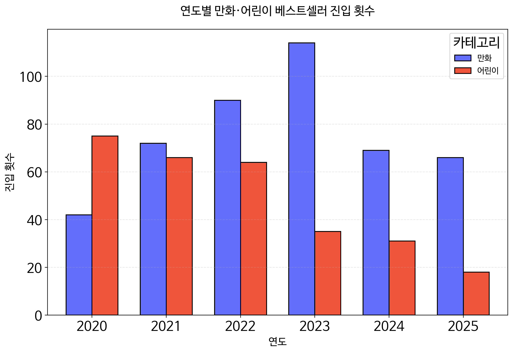

---

# 알라딘 월간 베스트셀러 데이터 분석 프로젝트

**기간:** 2020년 1월 ~ 2025년 11월 (71개월)  
**분석 대상:** 알라딘 월간 베스트셀러 TOP 50  
**GitHub:** https://github.com/su0907/aladin-reading-trend-project

---

# 1. 프로젝트 개요

## 1.1 목적

본 프로젝트는 2020~2025년 알라딘 월간 베스트셀러 데이터를 크롤링 및 분석하여 독서 트렌드 변화를 파악하는 것을 목표로 합니다.

## 1.2 기술 스택

- **언어:** Python 3.10+
- **크롤링:** BeautifulSoup4, urllib
- **데이터 처리:** Pandas, NumPy
- **시각화:** Matplotlib, Seaborn, Plotly
- **병렬 처리:** ThreadPoolExecutor (concurrent.futures)
- **환경:** Google Colab
- **저장/관리:** Google Drive

---

# 2. 데이터 수집

## 2.1 크롤링 대상 및 기간

| 항목 | 내용 |
|------|------|
| **대상 사이트** | 알라딘 (www.aladin.co.kr) |
| **수집 기간** | 2020년 1월 ~ 2025년 11월 (71개월) |
| **수집 범위** | 월간 베스트셀러 TOP 50 |
| **이론적 수집량** | 71개월 × 50개 = 3,550개 |
| **실제 수집량** | 3,539개 (11개 누락) |

## 2.2 1차 크롤링: 월간 베스트셀러 리스트

### 2.2.1 URL 구조 분석

알라딘 월간 베스트셀러 페이지의 URL 구조는 다음과 같습니다:
```
https://www.aladin.co.kr/shop/common/wbest.aspx?BranchType=1&BestType=Month&Year={year}&Month={month}

파라미터:
- BranchType=1: 국내도서
- BestType=Month: 월간 베스트셀러
- Year={year}: 연도 (2020~2025)
- Month={month}: 월 (1~12)
```

### 2.2.2 HTML 선택자 탐색

웹 브라우저의 F12 개발자 도구를 사용하여 HTML 구조를 분석하고, 다음과 같은 CSS Selector를 추출했습니다:

| 데이터 | CSS Selector |
|--------|--------------|
| 도서 컨테이너 | `div.ss_book_box` |
| 제목 | `a.bo3` |
| 저자 | `li.ss_aut a` |
| 카테고리 | `span.tit_category` |
| 가격 | `span.ss_p2 b` |
| 평점 | `span.Ere_fs14.Ere_str` |

### 2.2.3 크롤링 코드 (핵심 로직)

**도서 정보 추출 부분:**
```python
# 도서 정보 추출
items = soup.select("div.ss_book_box")
books = []

for rank, item in enumerate(items, 1):
    try:
        # 제목
        title_tag = item.select_one("a.bo3")
        title = title_tag.text.strip() if title_tag else "N/A"
        
        # 저자
        author_tag = item.select_one("li.ss_aut a")
        author = author_tag.text.strip() if author_tag else "N/A"
        
        # 카테고리
        category_tag = item.select_one("span.tit_category")
        category = category_tag.text.strip() if category_tag else "N/A"
        
        # 가격
        price_tag = item.select_one("span.ss_p2 b")
        price = int(price_tag.text.strip().replace(',', '')) if price_tag else 0
        
        # 평점
        star_tag = item.select_one("span.Ere_fs14.Ere_str")
        star_score = float(star_tag.text.strip()) if star_tag else 0.0
        
        # item_id (도서 고유 ID)
        link_tag = item.select_one("a.bo3")
        item_id = link_tag['href'].split('ItemId=')[1].split('&')[0] if link_tag else "N/A"
        
        books.append({
            'year': year,
            'month': month,
            'rank': rank,
            'title': title,
            'author': author,
            'category': category,
            'price': price,
            'star_score': star_score,
            'item_id': item_id
        })
    except Exception as e:
        print(f"Error at {year}-{month} rank {rank}: {e}")
        continue
```

**전체 기간 크롤링 설정:**
```python
# 전체 기간 크롤링 실행 (2020년 1월 ~ 2025년 11월)
all_books = []
for year in range(2020, 2026):
    for month in range(1, 13):
        if year == 2025 and month > 11:  # 2025년 11월까지만
            break
        
        print(f"Crawling {year}-{month:02d}...")
        books = crawl_bestseller(year, month)
        all_books.extend(books)
        time.sleep(1)  # 서버 부하 방지
```

> **Note:** 전체 코드는 [GitHub Repository](https://github.com/su0907/aladin-reading-trend-project/blob/main/notebooks/01_crawling.ipynb)에서 확인 가능합니다.

### 2.2.4 수집 결과
```
총 수집: 3,539개 행
예상 수집: 3,550개 행
누락: 11개 (0.3%)

누락 상세:
- 2020년 4월: 1개 누락 (49개 수집)
- 2023년 2~11월: 각 1개씩 누락 (10개월, 각 49개 수집)
```

## 2.3 2차 크롤링: 도서 상세 정보

### 2.3.1 크롤링 목적

1차 크롤링에서는 **포괄적 카테고리**(예: "국내도서")만 수집되었으므로, 도서 상세 페이지에서 **구체적 카테고리**(예: "소설/시/희곡")와 **페이지 수**를 추가로 수집합니다.

### 2.3.2 도서 상세 페이지 구조
```
URL: https://www.aladin.co.kr/shop/wproduct.aspx?ItemId={item_id}

추출 정보:
1. detail_category (상세 카테고리)
   - 선택자: ul#ulCategory li a
   - 예시: "국내도서 > 소설/시/희곡"
   
2. page_count (페이지 수)
   - 선택자: div.conts_info_list1 ul li
   - 예시: "368쪽"
```

### 2.3.3 병렬 처리 구현

고유 도서 1,958개의 상세 페이지를 효율적으로 크롤링하기 위해 **ThreadPoolExecutor**를 사용한 병렬 처리를 구현했습니다 (15개 스레드 동시 실행).

> **Note:** 전체 코드는 [GitHub Repository](https://github.com/su0907/aladin-reading-trend-project/blob/main/notebooks/01_crawling.ipynb)에서 확인 가능합니다.

### 2.3.4 수집 결과
```
고유 도서: 1,958개
수집 성공: 1,958개
```

## 2.4 크롤링 이슈 및 해결

### 이슈 1: HTML 선택자 오타

**문제:**
- 초기 코드에서 `span.tit_catrgory`로 오타 발생 ("category" 스펠링 오류)
- 모든 도서의 `category` 값이 `None`으로 수집됨

**해결:**
- `span.tit_category`로 수정
- 카테고리 정보 정상 수집 확인

---

### 이슈 2: 50위 도서 크롤링 실패

**문제:**
- BeautifulSoup 파싱 결과 49개만 수집 (50개 예상)
- F12 개발자 도구로 확인 시 50위 도서가 페이지에 존재

**해결 시도:**
1. **Selenium 사용:** Google Colab 환경에서 Chrome Driver 설치 실패
2. **대기 시간 추가:** 여전히 49개만 수집

**최종 결론:**
- 11개 데이터 누락 (전체의 0.3%)
- 분석에 미치는 영향 미미

---

### 이슈 3: 성인 도서 크롤링 제한

**문제:**
- 성인 인증이 필요한 도서는 상세 페이지 접근 불가
- `detail_category` = `None`, `page_count` = `0`으로 수집됨

**영향받은 데이터:**
```
총 21개 고유 도서
베스트셀러 진입 횟수: 22회
```

**해결:**
- 전처리 단계에서 제거 (3.3절 참조)

## 2.5 데이터 저장 구조
```
data/
├── raw/
│   ├── aladin.csv              # 1차 크롤링 결과
│   │   ├── 행 수: 3,539개
│   │   └── 컬럼: year, month, rank, title, author, 
│   │            category, price, star_score, item_id
│   │
│   └── detail_mapping.csv      # 2차 크롤링 결과
│       ├── 행 수: 1,958개 (고유 도서)
│       └── 컬럼: item_id, detail_category, page_count
│
└── processed/
    └── aladin_final_cleaned.csv  # 최종 정제 데이터
        ├── 행 수: 3,517개
        └── 컬럼: year, month, rank, title, author,
                 category, price, star_score, item_id, page_count        
```

---

# 3. 데이터 전처리 및 변환

## 3.1 데이터 병합

### 3.1.1 병합 전 데이터 상태

**aladin.csv (1차 크롤링):**
```
총 행 수: 3,539개
고유 도서: 1,958개
결측치: 없음

특징:
- 같은 도서가 여러 달 베스트셀러에 진입한 경우 여러 행으로 기록
- category: "국내도서" 등 포괄적 카테고리
- page_count: 모두 0 (정보 없음)
```

**detail_mapping.csv (2차 크롤링):**
```
총 행 수: 1,958개 (고유 도서)
결측치:
- detail_category: 21개 (1.1%)
- page_count: 0개 (모두 값 존재, 단 21개가 0)

특징:
- item_id 기준 1:1 매칭
- detail_category: "소설/시/희곡" 등 구체적 카테고리
- page_count = 0이면서 detail_category = NaN인 경우 = 성인 도서 (접근 불가)
```

### 3.1.2 병합 과정

**병합 전 결측치:**
```
detail_mapping.csv:
- item_id: 0개
- detail_category: 21개 (1.1%) ← 성인 도서
- page_count: 0개 (단, 21개가 0) ← 성인 도서
```

**병합 실행:**
- LEFT JOIN (item_id 기준)
- 1차 크롤링 데이터에 2차 크롤링 데이터 병합
- 결과: 3,539개 행

**병합 후 결측치:**
```
detail_category: 22개 (0.6%) ← 21개 고유 도서가 22회 진입
```

**22개 vs 21개 차이 원인:**
- **21개**: 고유 도서 개수 (detail_mapping.csv 기준)
- **22개**: 베스트셀러 진입 횟수 (aladin.csv 기준)
- 성인 도서 중 1개가 **2번 베스트셀러에 진입**

## 3.2 카테고리 정제

### 3.2.1 카테고리 업데이트

**업데이트 결과:**
```
카테고리 업데이트 성공: 3,517개 (99.4%)
카테고리 업데이트 실패: 22개 (0.6%)

업데이트 실패 사유: 성인 도서 (detail_category = NaN)
```

### 3.2.2 Before / After 비교

| item_id | category (Before) | detail_category | category (After) |
|---------|-------------------|-----------------|------------------|
| 123456 | 국내도서 | 소설/시/희곡 | 소설/시/희곡 |
| 234567 | 국내도서 | 인문학 | 인문학 |
| 345678 | 국내도서 | NaN | 국내도서 (→ 제거) |

### 3.2.3 최종 카테고리 분포
```
소설/시/희곡     742개
만화           453개
인문학         335개
경제경영       314개
어린이         289개
자기계발       244개
에세이         189개
외국어         172개
역사           148개
과학           127개
```

## 3.3 결측치 처리

### 3.3.1 페이지 수 업데이트
```
page_count = 0인 도서: 22개 (0.6%)
```

### 3.3.2 제거 대상 분석

성인 도서는 **page_count = 0 AND detail_category = NaN** 조건으로 식별합니다.
```
제거 대상:
- 행 수: 22회 (베스트셀러 진입 기준)
- 고유 도서: 21개
- 이유: 성인 도서 (상세 페이지 접근 불가)

도서별 진입 횟수:
- 21개 고유 도서가 총 22회 베스트셀러에 진입
- 이 중 1개 도서가 2번 진입
```

### 3.3.3 데이터 정제
```
최종 데이터:
- 병합 후: 3,539개 행
- 제거: 22개 행
- 최종: 3,517개 행
```

## 3.4 데이터 검증

**중복 데이터 확인:**
```
완전 중복 행: 0개
item_id + year + month 중복: 0개
```

## 3.5 최종 데이터 구조

### 3.5.1 컬럼 정보

| 컬럼명 | 데이터 타입 | 설명 | 결측치 | 예시 |
|--------|-------------|------|--------|------|
| year | int64 | 연도 | 0 | 2024 |
| month | int64 | 월 | 0 | 10 |
| rank | int64 | 순위 (1~50) | 0 | 1 |
| title | object | 도서명 | 0 | 소년이 온다 |
| author | object | 저자명 | 0 | 한강 |
| category | object | 카테고리 (22개) | 0 | 소설/시/희곡 |
| price | int64 | 가격 (원) | 0 | 14,220 |
| star_score | float64 | 평점 (0~10) | 0 | 9.2 |
| item_id | object | 도서 고유 ID | 0 | 8936433660 |
| page_count | int64 | 페이지 수 | 0 | 216 |

### 3.5.2 최종 통계
```
총 행 수: 3,517개
고유 도서: 1,937개
기간: 2020년 1월 ~ 2025년 11월
카테고리: 22개
평균 가격: 15,296원
평균 페이지: 334쪽
평균 평점: 9.05점
```

## 3.6 전처리 흐름도
```
┌─────────────────────────────────────┐
│   원본 데이터                          │
│   - aladin.csv: 3,539개              │
│   - detail_mapping.csv: 1,958개      │
└─────────────┬───────────────────────┘
              ↓
┌─────────────────────────────────────┐
│   1. 데이터 병합                       │
│   - LEFT JOIN (item_id 기준)         │
│   - 결과: 3,539개 행                  │
└─────────────┬───────────────────────┘
              ↓
┌─────────────────────────────────────┐
│   2. 카테고리 업데이트                   │
│   - detail_category → category      │
│   - 성공: 3,517개 (99.4%)             │
│   - 실패: 22개 (0.6%, 성인 도서)        │
└─────────────┬───────────────────────┘
              ↓
┌─────────────────────────────────────┐
│   3. 페이지 수 업데이트                 │
│   - page_count_new → page_count     │
│   - page_count = 0: 22개            │
└─────────────┬───────────────────────┘
              ↓
┌─────────────────────────────────────┐
│   4. 성인 도서 제거                    │
│   - 조건: page_count=0 AND           │
│          detail_category=NaN        │
│   - 제거: 22개 행 (21개 고유 도서)       │
└─────────────┬───────────────────────┘
              ↓
┌─────────────────────────────────────┐
│   5. 데이터 검증                       │
│   - 데이터 타입 통일                    │
│   - 중복 데이터 확인                    │
└─────────────┬───────────────────────┘
              ↓
┌─────────────────────────────────────┐
│   최종 데이터                          │
│   - 3,517개 행                       │
│   - 1,937개 고유 도서                  │
│   - 22개 카테고리                      │
│   - 결측치: 0개                       │
└─────────────────────────────────────┘
```

> **Note:** 전체 코드는 [GitHub Repository](https://github.com/su0907/aladin-reading-trend-project/blob/main/notebooks/02_data_preprocessing.ipynb)에서 확인 가능합니다.

---

# 4. 핵심 분석 결과

## 4.1 연도별 평균 가격 추이


**연도별 평균 가격 추이:**
```
2020년: 14,481원
2021년: 15,386원 (+6.2%)
2022년: 14,481원 (-5.9%) ← 급락
2023년: 15,340원 (+6.0%)
2024년: 16,010원 (+4.3%)
2025년: 16,158원 (+0.9%)
```

### 참고: 2022년 전체 출판 시장 신간 평균 정가


**대한출판문화협회 통계:**
```
2021년 발행 도서 평균 정가: 17,116원
2022년 발행 도서 평균 정가: 17,869원 (+4.4%)
```

**베스트셀러 vs 전체 신간 시장 비교:**
- **베스트셀러 시장**: 2021년 15,386원 → 2022년 14,481원 (-5.9%)
- **전체 신간 시장**: 2021년 17,116원 → 2022년 17,869원 (+4.4%)

**인사이트:** 2022년 전체 출판 시장의 신간 평균 정가는 상승한 반면, 베스트셀러 평균 가격은 하락했습니다. 이는 베스트셀러 시장이 전체 출판 시장과 다른 독립적인 메커니즘으로 작동하며, 특히 장르 구성 변화에 민감하게 반응함을 보여줍니다.

---

## 4.2 연도별 평균 페이지 수 추이


**연도별 평균 페이지 수 추이:**
```
2020년: 325쪽
2021년: 365쪽 (+12.3%)
2022년: 314쪽 (-14.0%) ← 급락
2023년: 342쪽 (+8.9%)
2024년: 333쪽 (-2.6%)
2025년: 328쪽 (-1.5%)
```

---

## 4.3 2022년 하락 원인 검증 (1): 만화/어린이 비중 변화



**만화/어린이 비중 변화:**
```
2020년: 117회 (19.5%)
2021년: 138회 (23.0%)
2022년: 154회 (25.7%) ← +2.7%p
2023년: 149회 (24.8%)
2024년: 100회 (16.7%)
2025년: 84회 (13.7%)
```

**인사이트:** 저가·저페이지 장르(만화/어린이)의 비중이 2021년 23.0%에서 2022년 25.7%로 증가하면서 전체 평균을 하락시키는 효과가 있었습니다.

---

## 4.4 2022년 하락 원인 검증 (2): 장르별 가격 비교


**장르별 평균 가격 추이:**
```
만화/어린이 제외 일반 도서:
- 2021년: 16,541원 (추정)
- 2022년: 16,006원 (추정)
- 변화: -3.2%

만화 평균 가격: 약 10,000원대 (일반 도서 대비 낮음)
어린이 평균 가격: 약 12,000원대 (일반 도서 대비 낮음)
```

**인사이트:** 만화/어린이를 제외한 일반 도서만 분석해도 가격 하락이 관찰되며, 이는 일반 도서 자체의 변화가 주된 요인임을 시사합니다.

---

## 4.5 2022년 하락 원인 검증 (3): 장르별 페이지 수 비교


**장르별 평균 페이지 수 추이:**
```
만화/어린이 제외 일반 도서:
- 2021년: 412쪽 (추정)
- 2022년: 355쪽 (추정)
- 변화: -13.8%

만화 평균 페이지: 약 200쪽 내외
어린이 평균 페이지: 약 180쪽 내외
```

**핵심 인사이트:** 

2022년 가격·페이지 하락은 **이중 구조**로 설명됩니다:

1. **일반 도서 자체의 변화** (가장 큰 원인): 페이지 수가 412쪽→355쪽으로 감소 (-13.8%)
2. **저가·저페이지 장르 비중 증가**: 만화/어린이가 23.0%→25.7%로 증가 (+2.7%p)

이를 통해 **베스트셀러 평균 지표가 장르 구성에 매우 민감하게 반응**함을 실증했으며, 시장 분석 시 장르별 분해 분석의 필요성을 확인했습니다.

---

## 4.6 카테고리별 베스트셀러 진입 도서 수


**TOP 5 카테고리:**
```
1. 소설/시/희곡: 741개
2. 만화: 453개
3. 인문학: 335개
4. 경제경영: 314개
5. 어린이: 289개
```

---

## 4.7 연도별 카테고리 비중 변화 (TOP 5)


**주요 트렌드:**
```
소설/시/희곡: 지속적으로 30% 내외 유지
만화: 2020년 17% → 2023년 32% (정점) → 2025년 15%
인문학: 2020년 8% → 2025년 23% (약 3배 증가)
경제경영: 2021년 20% → 2025년 8% (급감)
어린이: 2020~2025년 지속 감소 추세
```

---

## 4.8 슬램덩크 영화 개봉 효과


**슬램덩크 관련 도서 진입:**
```
2020~2022년: 0회
2023년: 53회 ← 영화 개봉 (2023.01.04)
2024년: 1회
2025년: 0회
```

**만화 비중 변화:**
```
2022년: 25%
2023년: 32% ← 정점 (슬램덩크가 만화 진입의 46% 차지)
2024년: 20%
```

**인사이트:** 영화 흥행(490만 관객)과 원작 판매 증가 간 강한 상관관계를 확인했습니다.

---

## 4.9 월별 카테고리 트렌드 (2020~2024년)


**월별 카테고리 트렌드 (상위 3개):**

시각적 가독성을 위해 베스트셀러 진입 비중이 높은 상위 3개 카테고리(소설, 경제경영, 만화)를 선정하여 월별 트렌드를 분석함.
```
소설/시/희곡: 10월 급증 (2024년 한강 노벨문학상 효과)
경제경영: 12월~1월 상승, 이후 감소 (반복 패턴 관찰)
```

**인사이트:** 소설은 외부 이벤트에 즉각 반응하며, 경제경영은 연말연초 계절성을 보입니다.

---

## 4.10 카테고리별 평균 가격 TOP 15


**고가 카테고리 TOP 3:**
```
1. 예술/대중문화: 22,510원
2. 요리/살림: 18,915원
3. 경제경영: 18,154원
```

**인사이트:** 베스트셀러 진입 빈도가 높은 카테고리 중 예술/대중문화, 요리/살림 등이 평균 가격이 높음을 알 수 있습니다.

---

## 4.11 가격 분포


**가격 분포:**
```
평균: 15,296원
중앙값: 15,120원
최빈 구간: 12,500~17,500원 (약 2,000개)
```

대부분의 도서가 12,500~17,500원 구간에 집중되어 있습니다.

---

## 4.12 작가별 베스트셀러 진입 횟수 TOP 20


**TOP 5 작가:**
```
1. ETS: 132회 (토익 공식 교재)
2. 최태성: 117회 (한국사 수험서)
3. David Cho: 68회 (토익 어학서)
4. 한강: 67회 (소설)
5. 이노우에 타케히코: 54회 (만화)
```

**특징:**
```
수험서/어학 (1~3위): 토익, 한국사 등 장기 수요 교재
문학 (4위): 노벨문학상 수상 효과
만화 (5위): 영화 개봉 연계 효과
```

**인사이트:** 베스트셀러 작가 상위권은 **실용서(토익, 한국사)가 지배적**이며, 문학·만화는 **외부 이벤트(노벨상, 영화)**에 의존하는 패턴을 보입니다.

---

## 4.13 카테고리별 평균 순위 TOP 15


**평균 순위가 높은(=낮은 숫자) 카테고리:**
```
예술/대중문화: 22.7위
사회과학: 22.9위
소설/시/희곡: 23.4위
```

낮을수록 상위권에 자주 진입하는 카테고리입니다.

---

## 4.14 월별 베스트셀러 1위 책 변화 (2024~2025)


**2024년 10월~2025년 1월:**
- **소년이 온다** (한강 작가) 4개월 연속 1위
- 노벨문학상 수상 직후 압도적 1위 유지

**2025년 2월 이후:**
다양한 도서들이 1위 차지 (혼모노, 스토너, 단 한 번의 삶 등)

---

## 4.15 한강 작가 vs 소설 시장 전체 (시장 점유율 변화)


**소설 시장 내 점유율:**
```
수상 전 평균 (2020.1~2024.9): 0.5%
수상 후 평균 (2024.10~2025.11): 7.2%
증가: +6.7%p (14.4배)

월별 최고점: 2024년 10월 17.3%
```

**핵심 인사이트:** 

노벨문학상 수상(2024.10.10) 직후 한강 작가의 도서가 소설 시장의 **17.3%를 점유**하며 폭발적인 반응을 보였습니다. 이후 점유율은 점진적으로 감소하지만, 수상 후 14개월 평균 7.2%로 **수상 전 대비 14.4배 증가**를 유지하고 있습니다.

이는 **외부 문화적 이벤트가 출판 시장에 즉각적이고 지속적인 영향**을 미친다는 것을 보여주며, 특히 권위 있는 상(노벨상)의 효과가 장기간 지속됨을 실증했습니다.

---

## 4.16 한강 작가 노벨문학상 수상 전후 비교


**베스트셀러 진입 횟수:**
```
수상 전 (2020.1~2024.9, 57개월): 7회
수상 후 (2024.10~2025.11, 14개월): 60회
증가율: +757% (약 8.6배)
```

**핵심 인사이트:**

한강 작가의 베스트셀러 진입 빈도 분석 결과:

1. **수상 전 (57개월)**: 평균 월 0.12회 진입 (8.1개월에 1번)
2. **수상 후 (14개월)**: 평균 월 4.29회 진입 (매달 4.3번)

이는 **월평균 진입 빈도 35.7배 증가**(0.12회→4.29회)를 의미합니다.

특히 주목할 점은:
- 수상 전: 주로 신작 출간 시기에만 베스트셀러 진입
- 수상 후: 구작을 포함한 전작이 동시다발적으로 베스트셀러 진입

이를 통해 **노벨상이 단순히 신작 판매에만 영향을 미치는 것이 아니라, 작가의 전체 작품군에 대한 재평가와 수요 증가로 이어진다**는 "후광 효과(Halo Effect)"를 확인했습니다.

---

## 4.17 한강 작가 작품별 베스트셀러 진입 횟수 TOP 5


**한강 작가 작품별 진입 횟수:**
```
1. 작별하지 않는다: 13회
2. 소년이 온다: 13회
3. 채식주의자 (리마스터판): 8회
4. 흰: 5회
5. 서랍에 저녁을 넣어 두었다: 5회
```

대표작 2개(작별하지 않는다, 소년이 온다)가 수상 후 집중적으로 베스트셀러에 진입했습니다.

---

## 4.18 한강 작품 평균 가격 vs 전체 비교


**평균 가격 비교:**
```
한강 작품: 13,849원
소설 카테고리: 16,411원
전체 베스트셀러: 15,296원
```

한강 작가의 작품은 소설 카테고리 평균보다 약 2,500원 저렴합니다.

---

## 4.19 한강 작품 평균 평점 vs 전체 비교


**평균 평점 비교:**
```
한강 작품: 8.99점
소설 카테고리: 8.86점
전체 베스트셀러: 9.05점
```

한강 작가의 작품은 소설 카테고리 평균보다 높은 평점을 유지하고 있습니다.

---

> **Note:** 전체 시각화 코드는 [GitHub Repository](https://github.com/su0907/aladin-reading-trend-project/blob/main/notebooks/03_visualization.ipynb)에서 확인 가능합니다.

---

# 5. 결론

본 프로젝트는 2020~2025년 알라딘 베스트셀러 3,517개를 분석하여 다음과 같은 핵심 인사이트를 도출했습니다.

## 주요 발견

**1. 외부 문화 이벤트의 즉각적 영향**
- **한강 노벨문학상:** 베스트셀러 진입 8.6배 증가, 소설 시장 점유율 14.4배 증가
- **슬램덩크 영화:** 원작 만화 53회 진입, 만화 비중 32% 정점 달성

**2. 장르 구성의 민감성**
- 2022년 가격·페이지 하락은 일반 도서 자체 변화(-3.2%, -13.8%) + 저가 장르 비중 증가(+2.7%p)의 복합 효과
- 베스트셀러 평균 지표는 장르 구성 변화에 매우 민감하게 반응
- 베스트셀러 시장과 전체 출판 시장은 독립적으로 작동 (2022년 베스트셀러 하락 vs 전체 신간 상승)

**3. 장기 독서 트렌드**
- **인문학 3배 성장**(8%→23%), **경제경영 급감**(20%→8%), **어린이 완만한 감소**
- 5년간 카테고리 구조의 점진적 변화 확인

**결론:** 베스트셀러 시장은 **(1) 외부 이벤트의 단기 충격**, **(2) 장르 구성 변화**, **(3) 장기 독서 트렌드**가 복합적으로 작용하며, 정확한 시장 분석을 위해서는 이 세 가지를 종합적으로 고려해야 합니다.

---

## 프로젝트의 한계

**1. 데이터 범위의 한계**
- 알라딘 단일 플랫폼만 분석 (교보문고, YES24 등 미포함)
- 베스트셀러 중심 분석으로 전체 출판 시장과 차이 가능

**2. 인과관계 검증의 한계**
- 외부 이벤트와 판매 증가 간 강한 상관관계 확인
- 직접적 인과관계 입증을 위해서는 추가 연구 필요 (언론 보도량, SNS 확산, 독자 구매 동기 등)

---

## GitHub Repository

**프로젝트 전체 코드 및 데이터:**  
https://github.com/su0907/aladin-reading-trend-project/tree/main

**포함 내용:**
- 크롤링 코드 (1차, 2차)
- 전처리 코드
- 시각화 코드 (15개 메인 시각화)
- 최종 데이터 (aladin_final_cleaned.csv)
- 프로젝트 문서 (README.md)

---

## 참고문헌

1. 알라딘, 월간 베스트셀러 TOP 50 (2020.01~2025.11)
   - https://www.aladin.co.kr/shop/common/wbest.aspx

2. 대한출판문화협회(2023.07.17). 『2022년 책 종수와 평균 정가』 통계 발표

---
